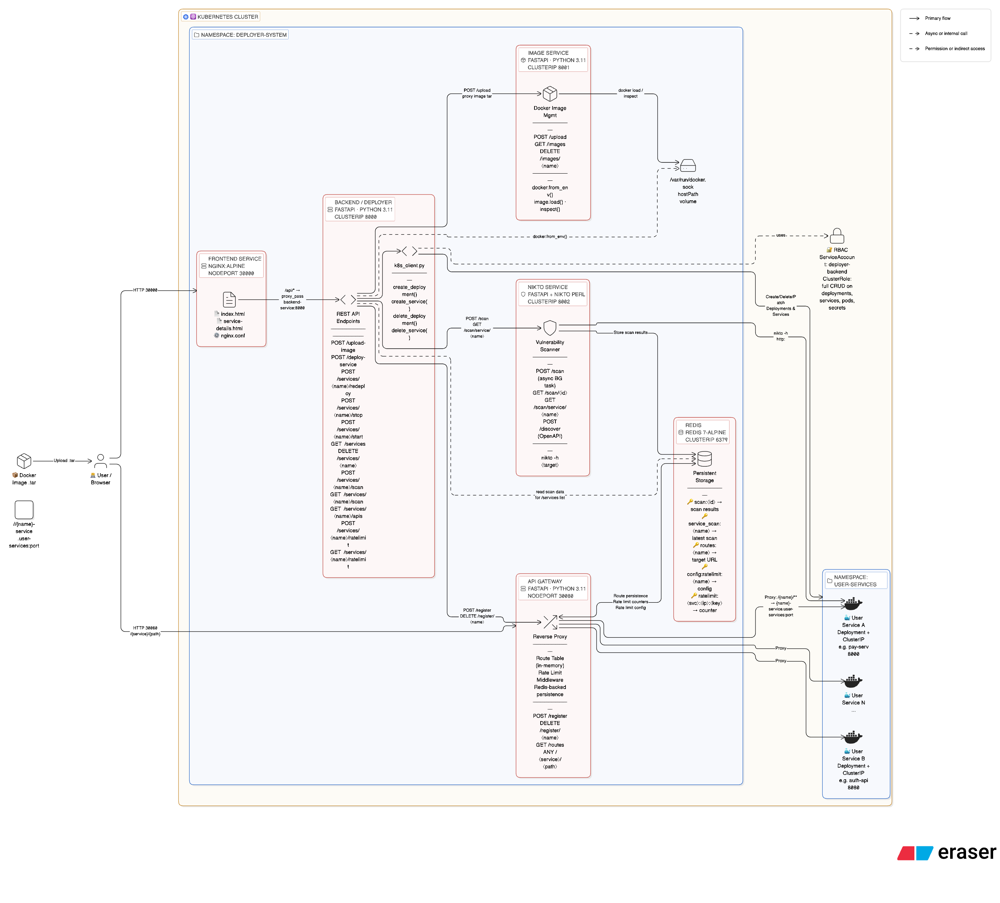

# SEcure Image [Microservice] Deployer 

A web-based platform that deploys Docker images into Kubernetes as internal microservices and exposes them securely through a centralized API gateway with built-in vulnerability scanning and per-route rate limiting.

---

## Architecture

<--

-->
### Security Model

| Component       | Service Type | External Access |
|-----------------|-------------|-----------------|
| Frontend        | NodePort    | ✅ Port 30000    |
| Backend API     | ClusterIP   | ❌ Internal only |
| Image Service   | ClusterIP   | ❌ Internal only |
| Nikto Service   | ClusterIP   | ❌ Internal only |
| Redis           | ClusterIP   | ❌ Internal only |
| Gateway         | NodePort    | ✅ Port 30080    |
| User Services   | ClusterIP   | ❌ Internal only |

All user-deployed microservices are **ClusterIP only** — never directly accessible from outside the cluster. The gateway is the **sole entry point**.

---

## Prerequisites

- [Docker Desktop](https://www.docker.com/products/docker-desktop) with **Kubernetes enabled**, or [Minikube](https://minikube.sigs.k8s.io/docs/start/)
- [kubectl](https://kubernetes.io/docs/tasks/tools/)

---

## Quick Start

```bash
# Clone and deploy everything in one command
cd secure-microservice-deployer
./scripts/deploy.sh
```

This builds all images, applies K8s manifests, waits for pods, and prints access URLs.

---

## Manual Setup

### 1. Enable Kubernetes

**Docker Desktop:**
> Settings → Kubernetes → ✅ Enable Kubernetes → Apply & Restart

**Minikube:**
```bash
minikube start --driver=docker
eval $(minikube docker-env)
```

### 2. Build Docker Images

```bash
./scripts/build.sh
```

Or manually:
```bash
docker build -t deployer-backend:latest  ./backend/deployer
docker build -t image-service:latest     ./backend/image
docker build -t nikto-service:latest     ./backend/nikto
docker build -t deployer-gateway:latest  ./backend/gateway
docker build -t deployer-frontend:latest ./frontend
```

### 3. Apply Kubernetes Manifests

```bash
kubectl apply -f k8s/namespace.yaml
kubectl apply -f k8s/user-namespace.yaml
kubectl apply -f k8s/rbac.yaml
kubectl apply -f k8s/redis.yaml
kubectl apply -f k8s/backend.yaml
kubectl apply -f k8s/image-service.yaml
kubectl apply -f k8s/nikto-service.yaml
kubectl apply -f k8s/gateway.yaml
kubectl apply -f k8s/frontend.yaml
```

### 4. Verify Pods

```bash
kubectl get pods -n deployer-system
```

Expected:
```
NAME                             READY   STATUS    RESTARTS   AGE
backend-xxx                      1/1     Running   0          30s
frontend-xxx                     1/1     Running   0          30s
gateway-xxx                      1/1     Running   0          30s
image-service-xxx                1/1     Running   0          30s
nikto-service-xxx                1/1     Running   0          30s
redis-xxx                        1/1     Running   0          30s
```

### 5. Access

| | Docker Desktop | Minikube |
|---|---|---|
| **Frontend** | http://localhost:30000 | `http://$(minikube ip):30000` |
| **Gateway** | http://localhost:30080 | `http://$(minikube ip):30080` |

---

## Stop / Start / Teardown

```bash
./scripts/stop.sh      # Scale all pods to 0 (preserves data)
./scripts/start.sh     # Scale back to 1
./scripts/teardown.sh  # Delete everything (namespaces + optional image cleanup)
```
